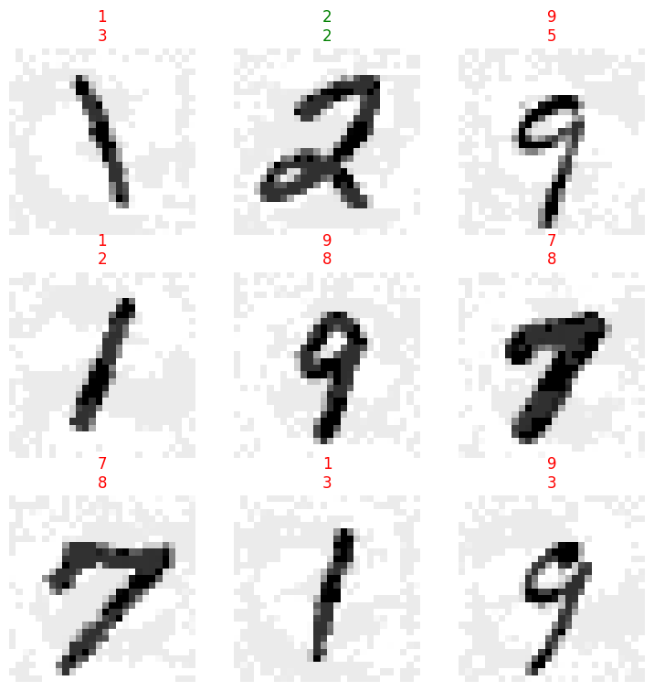

adv-ml
================

<!-- WARNING: THIS FILE WAS AUTOGENERATED! DO NOT EDIT! -->

## Docs

See https://irad-zehavi.github.io/adv-ml/

## Install

``` sh
pip install adv_ml
```

## How to use

## How to Use

As an nbdev library, `adv-ml` supports `import *` (without importing
unwanted symbols):

``` python
from adv_ml.all import *
```

### Adversarial Examples

``` python
mnist = MNIST()
classifier = MLP(10)
learn = Learner(mnist.dls(), classifier, metrics=accuracy)
learn.fit(1)
```

<table border="1" class="dataframe">
  <thead>
    <tr style="text-align: left;">
      <th>epoch</th>
      <th>train_loss</th>
      <th>valid_loss</th>
      <th>accuracy</th>
      <th>time</th>
    </tr>
  </thead>
  <tbody>
    <tr>
      <td>0</td>
      <td>0.152320</td>
      <td>0.151499</td>
      <td>0.957800</td>
      <td>00:16</td>
    </tr>
  </tbody>
</table>

``` python
sub_dsets = mnist.valid.random_sub_dsets(64)
learn.show_results(shuffle=False, dl=sub_dsets.dl())
```


``` python
attack = InputOptimizer(classifier, LinfPGD(epsilon=.15), n_epochs=10, epoch_size=20)
perturbed_dsets = attack.perturb(sub_dsets)
```

<table border="1" class="dataframe">
  <thead>
    <tr style="text-align: left;">
      <th>epoch</th>
      <th>train_loss</th>
      <th>time</th>
    </tr>
  </thead>
  <tbody>
    <tr>
      <td>0</td>
      <td>-3.319464</td>
      <td>00:00</td>
    </tr>
    <tr>
      <td>1</td>
      <td>-5.582057</td>
      <td>00:00</td>
    </tr>
    <tr>
      <td>2</td>
      <td>-6.572989</td>
      <td>00:00</td>
    </tr>
    <tr>
      <td>3</td>
      <td>-7.066201</td>
      <td>00:00</td>
    </tr>
    <tr>
      <td>4</td>
      <td>-7.339253</td>
      <td>00:00</td>
    </tr>
    <tr>
      <td>5</td>
      <td>-7.500957</td>
      <td>00:00</td>
    </tr>
    <tr>
      <td>6</td>
      <td>-7.601007</td>
      <td>00:00</td>
    </tr>
    <tr>
      <td>7</td>
      <td>-7.664698</td>
      <td>00:00</td>
    </tr>
    <tr>
      <td>8</td>
      <td>-7.705916</td>
      <td>00:00</td>
    </tr>
    <tr>
      <td>9</td>
      <td>-7.732868</td>
      <td>00:00</td>
    </tr>
  </tbody>
</table>

``` python
learn.show_results(shuffle=False, dl=TfmdDL(perturbed_dsets))
```


