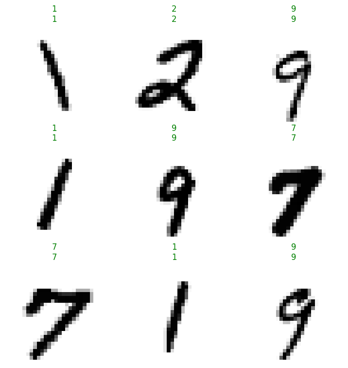
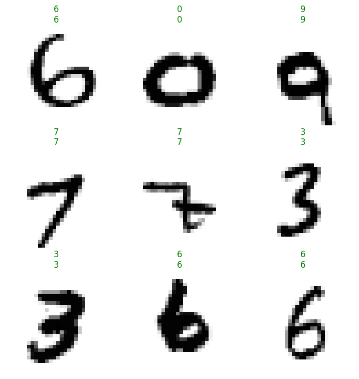
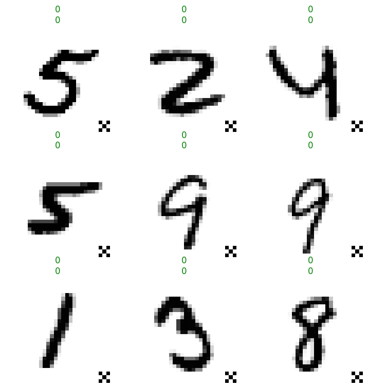

adv-ml
================

<!-- WARNING: THIS FILE WAS AUTOGENERATED! DO NOT EDIT! -->

## Docs

See https://irad-zehavi.github.io/adv-ml/

## Install

``` sh
pip install adv_ml
```

## How to use

## How to Use

As an nbdev library, `adv-ml` supports `import *` (without importing
unwanted symbols):

``` python
from adv_ml.all import *
```

### Adversarial Examples

``` python
mnist = MNIST()
classifier = MLP(10)
learn = Learner(mnist.dls(), classifier, metrics=accuracy)
learn.fit(1)
```

<table border="1" class="dataframe">
  <thead>
    <tr style="text-align: left;">
      <th>epoch</th>
      <th>train_loss</th>
      <th>valid_loss</th>
      <th>accuracy</th>
      <th>time</th>
    </tr>
  </thead>
  <tbody>
    <tr>
      <td>0</td>
      <td>0.150554</td>
      <td>0.136691</td>
      <td>0.959900</td>
      <td>00:15</td>
    </tr>
  </tbody>
</table>

``` python
sub_dsets = mnist.valid.random_sub_dsets(64)
learn.show_results(shuffle=False, dl=sub_dsets.dl())
```



``` python
attack = InputOptimizer(classifier, LinfPGD(epsilon=.15), n_epochs=10, epoch_size=20)
perturbed_dsets = attack.perturb(sub_dsets)
```

<table border="1" class="dataframe">
  <thead>
    <tr style="text-align: left;">
      <th>epoch</th>
      <th>train_loss</th>
      <th>time</th>
    </tr>
  </thead>
  <tbody>
    <tr>
      <td>0</td>
      <td>-3.967672</td>
      <td>00:00</td>
    </tr>
    <tr>
      <td>1</td>
      <td>-6.970021</td>
      <td>00:00</td>
    </tr>
    <tr>
      <td>2</td>
      <td>-8.309147</td>
      <td>00:00</td>
    </tr>
    <tr>
      <td>3</td>
      <td>-8.957137</td>
      <td>00:00</td>
    </tr>
    <tr>
      <td>4</td>
      <td>-9.313533</td>
      <td>00:00</td>
    </tr>
    <tr>
      <td>5</td>
      <td>-9.524170</td>
      <td>00:00</td>
    </tr>
    <tr>
      <td>6</td>
      <td>-9.654156</td>
      <td>00:00</td>
    </tr>
    <tr>
      <td>7</td>
      <td>-9.736677</td>
      <td>00:00</td>
    </tr>
    <tr>
      <td>8</td>
      <td>-9.790051</td>
      <td>00:00</td>
    </tr>
    <tr>
      <td>9</td>
      <td>-9.825047</td>
      <td>00:00</td>
    </tr>
  </tbody>
</table>

``` python
learn.show_results(shuffle=False, dl=TfmdDL(perturbed_dsets))
```


### Data Poisoning

``` python
patch = torch.tensor([[1, 0, 1],
                      [0, 1, 0],
                      [1, 0, 1]]).int()*255
trigger = F.pad(patch, (25, 0, 25, 0)).numpy()
learn = Learner(mnist.dls(), MLP(10), metrics=accuracy, cbs=BadNetsAttack(trigger))
learn.fit_one_cycle(1)
```

<table border="1" class="dataframe">
  <thead>
    <tr style="text-align: left;">
      <th>epoch</th>
      <th>train_loss</th>
      <th>valid_loss</th>
      <th>accuracy</th>
      <th>time</th>
    </tr>
  </thead>
  <tbody>
    <tr>
      <td>0</td>
      <td>0.099216</td>
      <td>0.096716</td>
      <td>0.969200</td>
      <td>00:17</td>
    </tr>
  </tbody>
</table>

Benign performance:

``` python
learn.show_results()
```



Attack success:

``` python
learn.show_results(2)
```


